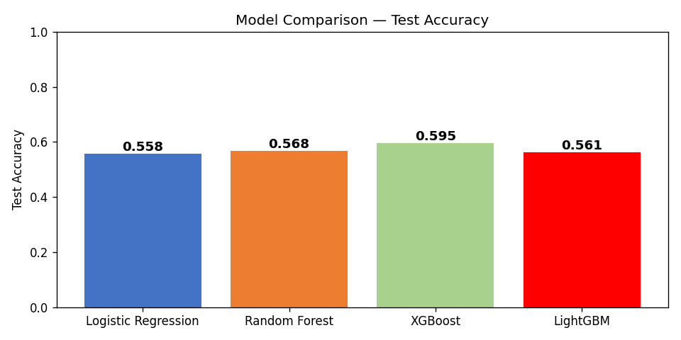
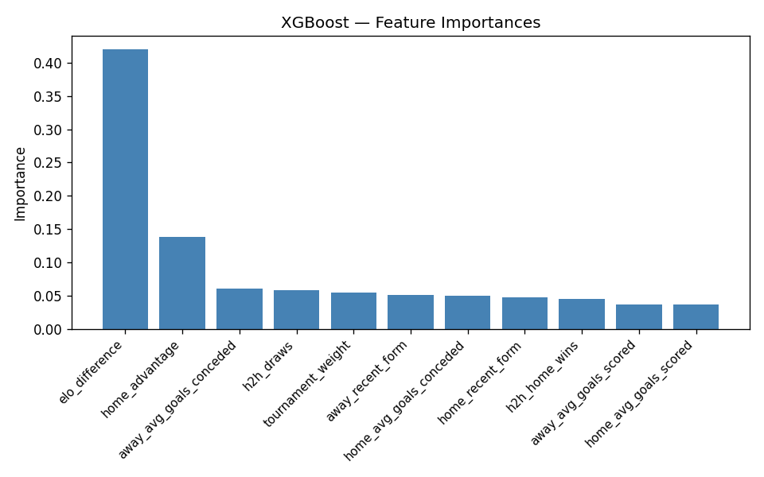
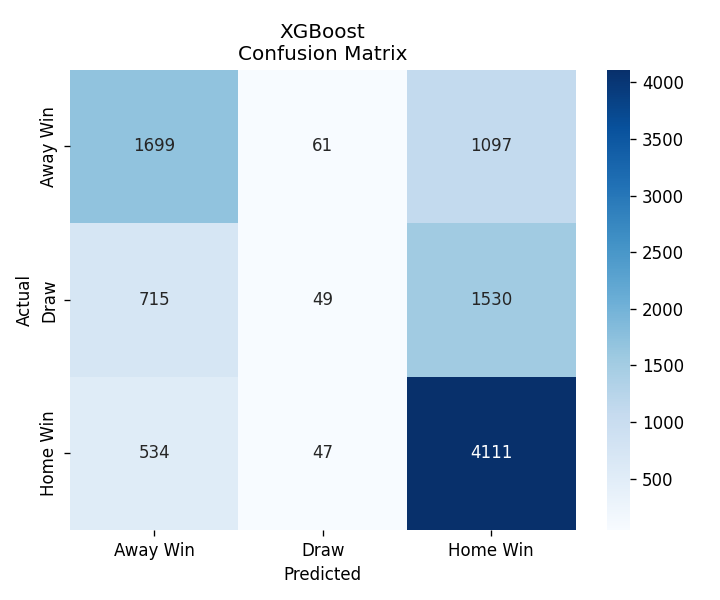

# FIFA Match Outcome Predictor

A machine learning system that predicts the outcome of any international football match — **Win / Draw / Loss** — using historical data, Elo ratings, and recent form metrics.

> **"Given Team A vs Team B, predict Win / Draw / Loss probability using historical international football data."**

---

## 🏆 Features

| Feature | Description |
|---------|-------------|
| **Elo Rating System** | Built from scratch using the World Football Elo formula |
| **Recent Form** | Last 5 matches — Win=3, Draw=1, Loss=0 |
| **Goals Scored / Conceded** | Rolling average over last 5 matches |
| **Head-to-Head Record** | Last 10 meetings between the two teams |
| **Home Advantage** | Encoded as 1 (home) or 0 (neutral venue) |
| **Tournament Weight** | Friendly → Qualifier → Continental → World Cup (0–4) |

---

## 📊 Models

| Model | Role |
|-------|------|
| Logistic Regression | Baseline |
| Random Forest | Ensemble |
| XGBoost | Primary |
| LightGBM | Primary |

**Target accuracy: 55–70%** (expert forecasters achieve ~55–60%)

---

## 🗂️ Project Structure

```
match-outcome-predictor/
├── data/
│   ├── results.csv          ← Download from Kaggle (see below)
│   └── elo.csv              ← Optional Elo dataset
├── notebooks/
│   └── analysis.ipynb       ← EDA + feature exploration
├── src/
│   ├── data_loader.py       ← Load & clean datasets
│   ├── elo_calculator.py    ← Custom Elo rating system
│   ├── feature_engineering.py ← All feature creation
│   ├── train.py             ← Train & evaluate models
│   └── predict.py           ← Prediction interface
├── models/                  ← Saved .pkl model files
├── app/
│   └── streamlit_app.py     ← Interactive web dashboard
├── requirements.txt
├── PRD.md
└── README.md
```

---

## ⚡ Quick Start

### 1. Install Dependencies

```bash
pip install -r requirements.txt
```

### 2. Download Data

Download these datasets from Kaggle and place CSVs in `data/`:

- **results.csv** → [International Football Results 1872–2026](https://www.kaggle.com/datasets/martj42/international-football-results-from-1872-to-2017)
- **elo.csv** (optional) → [International Football Elo Ratings](https://www.kaggle.com/datasets/saifalnimri/international-football-elo-ratings)

### 3. Train Models

```bash
python src/train.py
```

This will:
- Load and clean data
- Calculate Elo ratings from scratch
- Engineer all features
- Train Logistic Regression, Random Forest, XGBoost, LightGBM
- Save models to `models/`
- Generate evaluation plots

### 4. Launch the Dashboard

```bash
streamlit run app/streamlit_app.py
```

### 5. CLI Prediction

```bash
python src/predict.py --team-a "Portugal" --team-b "Germany" --tournament "FIFA World Cup"
```

**Output:**
```
=====================================================
  ⚽  Portugal  vs  Germany
=====================================================
  Portugal Win : 49.1%     ████████████████░░░░░░░░░░
  Draw       : 24.4%       ██████░░░░░░░░░░░░░░░░░░░░
  Germany  : 26.5%         █████████░░░░░░░░░░░░░░░░░

  🏆 Predicted: Portugal Win
  📊 Confidence: 49.1%
  🔢 Elo  — Portugal: 2012  |  Germany: 2012
=====================================================
```

### 6. Batch Predictions

```bash
python src/predict.py --input fixtures.csv --output predictions.csv
```

---

## 📊 Model Performance & Evaluation

The pipeline trains and evaluates four different classification models. Here is how they compare on the test dataset:

| Model | Accuracy | Log Loss | ROC-AUC |
| :--- | :---: | :---: | :---: |
| 🥇 **XGBoost** (Primary) | **59.52%** | **0.8779** | **0.7365** |
| 🥈 Random Forest | 56.76% | 0.9179 | 0.7346 |
| 🥉 LightGBM | 56.13% | 0.9091 | 0.7352 |
| 📉 Logistic Regression (Baseline) | 55.80% | 0.9095 | 0.7359 |

### 📈 Evaluation Plots

#### 1. Model Metric Comparison
Shows the comparative performance across Accuracy, Log Loss, and ROC-AUC.


#### 2. XGBoost Feature Importance
Visualizes the relative strength of the engineered features. The ELO rating difference is the dominant signal, followed by rolling goal averages and recent team form.


#### 3. XGBoost Confusion Matrix
Displays predicted vs. actual outcomes (Home Win, Draw, Away Win) for the best performing XGBoost classifier.


---

## 📚 Datasets Used

| Dataset | Source | Matches |
|---------|--------|---------|
| International Football Results | Kaggle (martj42) | 49,000+ |
| Elo Ratings | Kaggle (saifalnimri) | Historical |
| FIFA World Cup Matches | Kaggle (abecklas) | WC only |

---

## 🚀 Project Roadmap

**1**. [x] **Ensemble Classifiers**: Trained Logistic Regression, Random Forest, LightGBM, and XGBoost models.

**2**. [x] **Elo Rating System**: Custom Elo rating calculator built from scratch using historical match results.

**3**. [x] **Tactical Analytics Dashboard**: Interactive Streamlit web app showing ELO comparison, telemetry probability tracks, and matchup data sheets.

**4**. [ ] **Bracket Simulator**: Simulator forecasting entire tournament brackets (e.g. FIFA World Cup, Euros).

**5**. [ ] **Monte Carlo Simulations**: Monte Carlo match engine simulating matchups thousands of times to compute stable outcome variances.

**6**. [ ] **Live Prediction API**: FastAPI microservice to expose prediction models via REST endpoints.

---

## 🛠️ Tech Stack

| Component | Technology |
|-----------|------------|
| Language | Python 3.9+ |
| Data | Pandas, NumPy |
| ML | Scikit-Learn, XGBoost, LightGBM |
| Visualization | Matplotlib, Seaborn, Plotly |
| Dashboard | Streamlit |
| Model Storage | Joblib (Pickle) |

---

## 📄 License

[MIT LICENSE](https://github.com/Danish-dev25/FIFA-World-Cup-Match-Outcome-Predictor/LICENSE) — free to use for educational and portfolio purposes.

---

*Based on PRD: [Match Outcome Predictor using International Football Data](PRD.md)*
