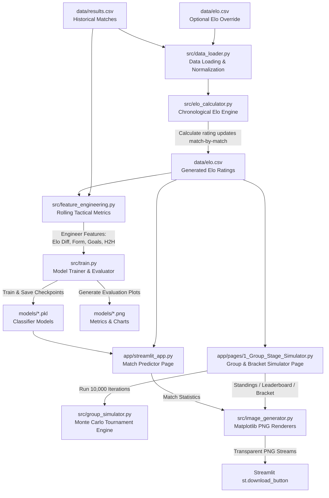

# FIFA World Cup Match Outcome Predictor & Tournament Simulator

A production-grade, end-to-end Machine Learning pipeline and interactive simulation suite built to predict international football match outcomes (Win / Draw / Loss) and simulate the FIFA World Cup 2026 using historical data, custom Elo ratings, and rolling tactical form metrics.

---

## 🧭 Project Blueprint & Data Flow

The architecture integrates data engineering, a custom chronological rating system, feature engineering, classification models, Monte Carlo simulation, and an interactive dashboard.



---

## 🏆 Key Features

* **Custom Chronological Elo Engine**: Recalculates team ratings match-by-match from 1872 to the present day using the official World Football Elo formula.
* **Rolling Form and Goal Metrics**: Computes team points (W=3, D=1, L=0), average goals scored, and goals conceded over a 5-match rolling window.
* **Head-to-Head Records**: Incorporates matchup history from the last 10 meetings between the two teams.
* **Monte Carlo Tournament Simulator**: Simulates the full 48-team FIFA World Cup 2026 (12 groups) 10,000 times to calculate round-by-round advancement probabilities.
* **Knockout Bracket Simulator**: Resolves brackets with standard FIFA third-place allocation rules, backtracking algorithms to prevent group-mate rematches, and penalty shootout simulation.
* **Live Match Tracker & Auto-Progression**: Tracks actual match scores, dynamically updates the tournament schedule on disk (`data/results.csv`), and advances qualified teams to their correct future slots automatically.
* **Shootout Winner Manager**: Detects draws in knockout stages, handles real-world shootout winners from `data/shootouts.csv`, and provides an interactive selectbox to input new shootout results directly inside match cards.
* **Server-Side Export Engine**: Renders high-resolution infographics, standing charts, leaderboards, and tree brackets as transparent PNGs served via native download prompts.

---

## 🗂️ Project Directory Structure

```
FIFA World Cup Match Outcome Predictor/
├── data/
│   ├── results.csv            ← Historical international matches (1872–present)
│   ├── shootouts.csv          ← Historical penalty shootout outcomes
│   ├── goalscorers.csv        ← Historical match goalscorers
│   ├── former_names.csv       ← Historical geopolitical team name mappings
│   ├── elo.csv                ← Chronological ELO ratings (calculated or user-edited)
│   ├── knockout_bracket.json  ← Structure and schedule of the 2026 World Cup knockout stage
│   └── README.md              ← Dataset descriptions and source details
├── src/
│   ├── __init__.py            
│   ├── data_loader.py         ← Cleans results and merges/normalizes Elo ratings
│   ├── elo_calculator.py      ← Custom rating system implementation
│   ├── feature_engineering.py   ← Generates rolling form, goal, and H2H statistics
│   ├── train.py               ← Fits models (XGBoost, LightGBM, RF) and saves plots
│   ├── predict.py             ← CLI inference interface and batch predictors
│   ├── group_simulator.py     ← World Cup group & bracket Monte Carlo simulator
│   └── image_generator.py     ← Server-side Matplotlib infographic PNG generators
├── models/
│   ├── best_model.pkl         ← Saved XGBoost model checkpoint
│   ├── xgboost.pkl            ← Fitted XGBoost classifier
│   ├── lightgbm.pkl           ← Fitted LightGBM classifier
│   ├── random_forest.pkl      ← Fitted Random Forest classifier
│   ├── logistic_regression.pkl← Fitted baseline Logistic Regression classifier
│   ├── feature_cols.pkl       ← Saved training feature columns list
│   └── *.png                  ← Metrics comparisons, confusion matrices, feature importance
├── app/
│   ├── streamlit_app.py       ← Match outcome predictor UI page
│   ├── shared_theme.py        ← Tactical dark-mode CSS theme & flag CDN utility
│   └── pages/
│       ├── 1_Group_Stage_Simulator.py ← Multi-tab tournament simulation UI
│       └── 2_WC_2026_Live_Results.py  ← Real-time results tracker and bracket display
├── notebooks/
│   └── analysis.ipynb         ← Exploratory data analysis notebook
├── requirements.txt           ← Python virtual environment dependencies
├── PRD.md                     ← Original Product Requirements Document
└── README.md                  ← Detailed project manual (this file)
```

---

## ⚡ Quick Start

### 1. Environment Setup & Installation

Clone this repository to your local system and install all required packages:

```bash
# Install dependencies
pip install -r requirements.txt
```

### 2. Download Kaggle Datasets

Ensure the following CSV files are placed in the `data/` directory:
* **results.csv**, **shootouts.csv**, and **goalscorers.csv** from [International Football Results (1872–present)](https://www.kaggle.com/datasets/martj42/international-football-results-from-1872-to-2017)
* **former_names.csv** (provided in the repository)

### 3. Run Pipeline Training

Execute the training script to clean data, recalculate the ELO history from scratch, generate rolling features, train the classifiers, and save model evaluation plots:

```bash
python src/train.py
```

### 4. Run the Streamlit Interactive Dashboard

Launch the tactical web application locally:

```bash
streamlit run app/streamlit_app.py
```

### 5. Deploying to Streamlit Cloud

To host the interactive dashboard on Streamlit Community Cloud:
1. Ensure the required data and model checkpoints are pushed to GitHub. The whitelisted patterns in `.gitignore` ensure `data/results.csv`, `data/shootouts.csv`, `models/best_model.pkl`, and `models/feature_cols.pkl` are tracked and pushed.
2. Connect your GitHub repository to [Streamlit Share](https://share.streamlit.io/).
3. The platform will automatically install dependencies from `requirements.txt` and launch the app in the cloud.

---

## ⚙️ Detailed Working & Pipelines

### 1. Data Cleaning & Elo Engine
* **Normalization**: [data_loader.py](file:///c:/Users/Danish/Desktop/GITHUB%20REPOS/FIFA%20World%20Cup%20Match%20Outcome%20Predictor/src/data_loader.py) cleans up geopolitical name changes (e.g., Soviet Union $\rightarrow$ Russia) and matches names to ISO codes for Flag CDN display.
* **Elo Updates**: [elo_calculator.py](file:///c:/Users/Danish/Desktop/GITHUB%20REPOS/FIFA%20World%20Cup%20Match%20Outcome%20Predictor/src/elo_calculator.py) iterates chronologically through all matches since 1872. The rating update formula is:
  $$R_{\text{new}} = R_{\text{old}} + K \times G \times (W - W_e)$$
  where $K$ is the tournament weight, $G$ is a goal-difference modifier, $W$ is the actual outcome (1 = Win, 0.5 = Draw, 0 = Loss), and $W_e$ is the expected probability calculated using the sigmoid function:
  $$W_e = \frac{1}{10^{-dR/400} + 1}$$

### 2. Feature Engineering
The pipeline in [feature_engineering.py](file:///c:/Users/Danish/Desktop/GITHUB%20REPOS/FIFA%20World%20Cup%20Match%20Outcome%20Predictor/src/feature_engineering.py) generates classification features for each match:
* **Elo Difference**: Pre-match rating difference ($R_{\text{home}} - R_{\text{away}}$).
* **Recent Form (5 matches)**: A weighted points average (Win = 3, Draw = 1, Loss = 0).
* **Average Goals Scored & Conceded**: Rolling average of goals over the last 5 matches.
* **Head-to-Head Record**: Percentage of home wins, away wins, and draws in the last 10 historical meetings.
* **Venue Bias**: Binary encoding for home advantage (neutral vs. home).
* **Tournament Importance**: Mapped weight (0 = Friendly, 1 = Qualifiers/Minor Cup, 2 = Continental Cup, 3 = FIFA World Cup).

### 3. Machine Learning Models
Four models are trained and compared in [train.py](file:///c:/Users/Danish/Desktop/GITHUB%20REPOS/FIFA%20World%20Cup%20Match%20Outcome%20Predictor/src/train.py):
1. **XGBoost (Primary)**: Gradient-boosted decision trees. Achieves the highest test accuracy.
2. **LightGBM**: Fast, leaf-wise gradient-boosted trees.
3. **Random Forest**: Bagged decision tree ensemble.
4. **Logistic Regression**: Baseline classifier.

#### Model Performance Comparison:
| Model | Test Accuracy | Log Loss | ROC-AUC |
| :--- | :---: | :---: | :---: |
| 🥇 **XGBoost** | **59.52%** | **0.8779** | **0.7365** |
| 🥈 Random Forest | 56.76% | 0.9179 | 0.7346 |
| 🥉 LightGBM | 56.13% | 0.9091 | 0.7352 |
| 📉 Logistic Regression | 55.80% | 0.9095 | 0.7359 |

### 4. Live Predictions Tracker & Bracket Progression
The [2_WC_2026_Live_Results.py](file:///c:/Users/Danish/Desktop/GITHUB%20REPOS/FIFA%20World%20Cup%20Match%20Outcome%20Predictor/app/pages/2_WC_2026_Live_Results.py) tracker keeps a live match ledger and builds the active knockout stage tree:
* **Stage-level Telemetry**: Segmented controls filter summary telemetry (Total Matches, Played, Correct Predictions, and Model Accuracy) dynamically for the selected round.
* **Auto-progression & disk sync**: When a match concludes, the bracket solver automatically identifies the qualifying winner, updates their team name in subsequent knockout slots in `data/results.csv` on disk, clears Streamlit's cache, and triggers a hot-reload.
* **Shootout resolutions**: Draws in knockout matches render shootout outcomes. If the winner is missing, the match card displays an interactive selectbox to input the shootout winner and save it directly to `data/shootouts.csv`.

---

## 🔮 Tournament Monte Carlo Simulator

The World Cup 2026 Simulator in [group_simulator.py](file:///c:/Users/Danish/Desktop/GITHUB%20REPOS/FIFA%20World%20Cup%20Match%20Outcome%20Predictor/src/group_simulator.py) models the expanded 48-team, 12-group tournament:

1. **Group Stage**: Simulates all group stage fixtures using Poisson-distributed goal expectations. Teams are ranked inside each group based on FIFA rules (Points $\rightarrow$ Goal Difference $\rightarrow$ Goals Scored).
2. **Third-Place Allocation**: Ranks all third-placed teams across the 12 groups, selects the 8 best, and allocates them into the Round of 32 knockout slots using a backtracking eligibility solver that respects bracket rules and prevents immediate group-mate rematches.
3. **Knockout Stage**: Simulates matchups through the Round of 32, Round of 16, Quarterfinals, Semifinals, and Final. Draws are resolved with extra-time simulation and penalty shootouts (50/50 probability splits).
4. **Aggregation**: Running the simulation 10,000 times generates probability thresholds for each nation's likelihood of reaching each round of the tournament.

---

## 💾 Server-Side PNG Export Engine

To bypass client-side CORS issues and iframe sandboxing limitations, the app utilizes a server-side rendering pipeline in [image_generator.py](file:///c:/Users/Danish/Desktop/GITHUB%20REPOS/FIFA%20World%20Cup%20Match%20Outcome%20Predictor/src/image_generator.py):

* **Matplotlib Infographics**: Custom rendering functions draw clean, telemetry-style dashboard cards (Matchup probabilities, Group Stage standings grids, full 48-team Leaderboards, and tree bracket charts) natively in Python.
* **Transparent Fallback**: Images are saved with `transparent=True` in Matplotlib's `savefig` call. This removes solid background colors and allows the exported files to blend with any external slide deck, report, or dark/light container theme.
* **Caching & Reloading**: Wrapped with `@st.cache_data(show_spinner=False)` to prevent redundant rendering lag. Added `importlib.reload` hot-reloading at startup to force Streamlit to refresh helper module edits immediately.
